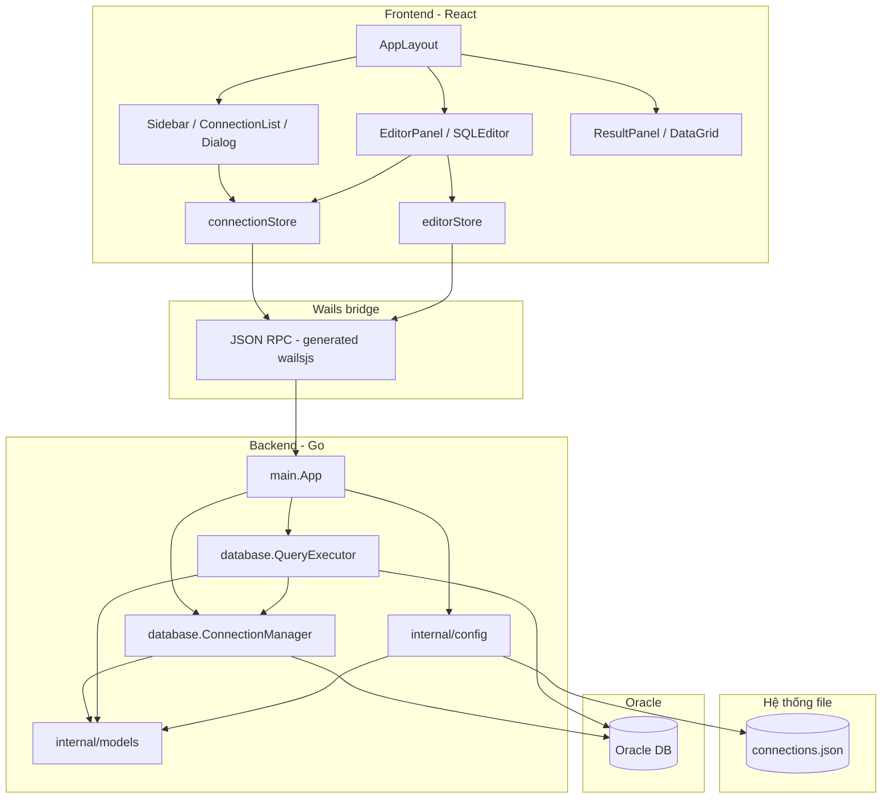

# Kiến trúc dự án Oracle SQL Lite

Tài liệu mô tả thiết kế tổng thể, các lớp phần mềm, luồng dữ liệu và ràng buộc kỹ thuật của ứng dụng desktop kết nối Oracle Database.

---

## 1. Tổng quan

**Oracle SQL Lite** là ứng dụng desktop cho phép:

- Lưu và quản lý **profile kết nối** Oracle (host, port, service/SID, user, role).
- **Kết nối** tới Oracle qua pool `database/sql`, chạy **SELECT/WITH** (trả grid) và **DML/DDL** (đường Exec).
- **Commit / Rollback** phiên trên pool đang dùng.
- Soạn SQL trong **Monaco Editor**, nhiều tab worksheet, hiển thị kết quả và thông điệp.

Ứng dụng được xây bằng **[Wails v2](https://wails.io/)**: backend **Go** (logic, Oracle, file) + frontend **React/TypeScript** nhúng trong **WebView2** (Windows). Binary Go embed thư mục build `frontend/dist`.

---

## 2. Stack công nghệ

| Lớp | Công nghệ |
|-----|-----------|
| Desktop shell | Wails v2.12, Go 1.23 |
| Oracle client | [godror](https://github.com/godror/godror) (CGO, Oracle Instant Client) |
| Frontend | React 18, TypeScript, Vite 3 |
| UI | Ant Design 6, `@ant-design/icons` |
| Editor | Monaco (`@monaco-editor/react`) |
| Layout pane | Allotment (chia cửa sổ) |
| State client | Zustand |
| ID profile | `github.com/google/uuid` |

---

## 3. Kiến trúc tổng thể



**Nguyên tắc:**

- Mọi gọi từ UI tới Oracle hoặc file cấu hình đi qua struct `App` được Wails **bind** (hàm public trên `App` xuất hiện trong `frontend/wailsjs/go/main/App`).
- Frontend không chứa driver Oracle; chỉ gửi/nhận JSON tương thích struct Go.

---

## 4. Cấu trúc thư mục (mã nguồn chính)

```
oracle_client_soft/
├── main.go                 # wails.Run, embed frontend/dist, OnStartup/OnShutdown
├── app.go                  # struct App - surface Wails (SaveConnection, Connect, ExecuteSQL, …)
├── wails.json              # cấu hình Wails (tên app, build frontend)
├── go.mod
├── internal/
│   ├── models/
│   │   ├── connection.go   # ConnectionConfig + Validate / ValidateForConnect
│   │   └── query.go        # QueryResult, ColumnInfo
│   ├── config/
│   │   └── config.go       # Đọc/ghi connections.json, đồng bộ mutex
│   └── database/
│       ├── connection.go   # ConnectionManager, godror, pool *sql.DB
│       └── executor.go     # QueryExecutor, phân loại SQL, Query/Exec
├── frontend/
│   ├── src/
│   │   ├── App.tsx
│   │   ├── main.tsx        # Ant Design dark theme, root
│   │   ├── setupMonaco.ts
│   │   ├── types/index.ts  # mirror JSON Wails
│   │   ├── stores/         # connectionStore, editorStore
│   │   ├── components/
│   │   │   ├── Layout/     # AppLayout, Sidebar, StatusBar
│   │   │   ├── Connection/ # ConnectionDialog, ConnectionList
│   │   │   ├── Editor/     # tabs, toolbar, Monaco
│   │   │   └── Results/    # grid, messages
│   │   └── utils/
│   ├── package.json
│   └── vite.config.ts (nếu có)
├── wailsjs/                # sinh bởi Wails - binding Go → TS
└── docs/
```

---

## 5. Backend Go

### 5.1. Điểm vào (`main.go`)

- Embed toàn bộ `frontend/dist` vào binary.
- Khởi tạo `NewApp()`, đăng ký `OnStartup` / `OnShutdown` (đóng pool khi thoát).
- `Bind: []interface{}{ app }` — expose method trên `*App` cho frontend.

### 5.2. Lớp `App` (`app.go`)

Đóng vai **facade** cho UI:

| Phương thức | Chức năng |
|-------------|-----------|
| `SaveConnection` | Thêm/sửa profile → `config.AddConnection` |
| `GetSavedConnections` | `config.LoadConnections` |
| `DeleteConnection` | Xóa file + `connMgr.Disconnect` |
| `Connect` | Load profile theo id, `connMgr.Connect` |
| `Disconnect` | Đóng pool theo id |
| `TestConnection` | Mở kết nối tạm, ping, đọc `v$version` (hoặc fallback) |
| `ExecuteSQL` | `executor.Execute` |
| `Commit` / `Rollback` | `executor.Commit` / `Rollback` |
| `GetActiveConnectionID` | Id pool “active” sau lần Connect gần nhất |

### 5.3. `internal/models`

- **`ConnectionConfig`**: id, name, host, port, serviceName/sid, username, password, role (SYSDBA, …).
- **`QueryResult`**: columns, rows, rowCount, execTimeMs, messages, hasMore — dùng chung cho Wails JSON.

### 5.4. `internal/config`

- Đường dữ liệu: `%UserConfigDir%/OracleSQLLite/connections.json` (Windows thường gần `%APPDATA%`).
- Ghi **atomic**: file `.tmp` rồi `rename`.
- `sync.RWMutex` bảo vệ đọc/ghi.
- `AddConnection`: id rỗng → UUID mới; id trùng → cập nhật.
- **Lưu ý bảo mật:** mật khẩu **plaintext** trong Phase 1 (có ghi chú trong code; kế hoạch mã hóa sau).

### 5.5. `internal/database` — `ConnectionManager`

- Giữ `map[string]*sql.DB` và `map[string]ConnectionConfig`, `activeConnID`.
- **Chuỗi kết nối:** Easy Connect `host:port/service?connect_timeout=15` (service hoặc SID theo field cấu hình).
- Driver: `sql.OpenDB(godror.NewConnector(P))` với `AdminRole` map từ `cfg.Role`.
- Pool: `MaxOpenConns=5`, `MaxIdleConns=2`, `ConnMaxLifetime=30m`.
- `Connect`: đóng pool cũ cùng id nếu có, ping trước khi gán active.
- `CloseAll` khi shutdown app.

### 5.6. `internal/database` — `QueryExecutor`

- `resolveDB(connID)`: rỗng → dùng `activeConnID`; kiểm tra pool đã mở.
- **`ClassifyStatement`:** sau khi bỏ comment/whitespace đầu — `BEGIN`/`DECLARE` → PL/SQL; `SELECT`/`WITH` → query; còn lại → DML path (Exec).
- **Phase 1:** PL/SQL block trả lỗi “not supported” (Phase 2 dự kiến mở rộng).
- **Query:** `QueryContext`, giới hạn số dòng (`maxRows`, mặc định 500), `HasMore` nếu còn dòng.
- **DML:** `ExecContext`, `RowsAffected`, không tự commit (phụ thuộc autocommit/transaction của session).
- **Normalize cell:** `[]byte` → UTF-8 string hoặc base64; `time.Time` → RFC3339Nano; `godror.Number` → string; v.v.
- Timeout mặc định ~60s cho thao tác SQL.

---

## 6. Frontend React

### 6.1. Bố cục UI (`AppLayout`)

- **Allotment** ngang: Sidebar (connections) | vùng chính.
- Vùng chính chia dọc: **Editor** (~60%) | **Results** (~40%).
- **StatusBar** dưới cùng.

### 6.2. State

- **`connectionStore` (Zustand):** danh sách profile, `activeConnectionId`, trạng thái kết nối; gọi `GetSavedConnections`, `Connect`, `Disconnect`, `SaveConnection`, `DeleteConnection`, `GetActiveConnectionID`.
- **`editorStore`:** tabs worksheet (id, title, content, optional `connectionId`), kết quả theo tab, sub-tab Results/Messages, loading execute.

### 6.3. Luồng chạy SQL (`EditorPanel`)

- Lấy SQL từ Monaco hoặc store; `connectionId` của tab ưu tiên hơn `activeConnectionId` global.
- `ExecuteSQL(connId, sql, 500)` → `applyExecutionResult`.
- Toolbar: **Commit** / **Rollback** gọi `Commit` / `Rollback` với cùng quy tắc chọn connection.

### 6.4. Kết nối (`ConnectionDialog`)

- Form Ant Design; **Test** gọi `TestConnection` (không bắt buộc lưu file).
- Lưu gọi `saveConnection` → backend persist.

### 6.5. Generated bindings

- Import từ `wailsjs/go/main/App` — **cần chạy `wails dev` hoặc generate** khi đổi chữ ký method Go.

---

## 7. Luồng dữ liệu điển hình

1. **Khởi động:** Go load WebView → React `loadConnections()` → hiển thị sidebar.
2. **User Connect:** `Connect(id)` → Go đọc profile từ JSON → mở pool → set active.
3. **Execute:** UI → `ExecuteSQL` → `ClassifyStatement` → Query hoặc Exec → `QueryResult` JSON → grid/messages.
4. **Thoát:** `OnShutdown` → `CloseAll` đóng mọi `*sql.DB`.

---

## 8. Build và phát triển

- **Dev:** `wails dev` — Vite HMR + rebuild Go khi cần.
- **Release:** `wails build` — npm build frontend, compile Go, nhúng assets.
- **Yêu cầu môi trường:** Node/npm, Go toolchain, **Oracle Instant Client** (và CGO/GCC phù hợp) cho godror trên Windows.

---

## 9. Ràng buộc và hướng mở rộng

| Hiện trạng | Ghi chú |
|-------------|---------|
| Mật khẩu lưu plaintext | Cần mã hóa trước production |
| PL/SQL block | Chưa chạy qua executor Phase 1 |
| Phân trang kết quả | `HasMore` đã có model; UI pagination có thể bổ sung |
| Đa kết nối đồng thời | Pool theo id; UI chủ yếu một “active” + override theo tab |

Tài liệu chi tiết theo phase: `docs/phase1-todolist.md`.

---

## 10. Phụ lục: API Wails (method public trên `App`)

Các hàm sau được bind cho frontend (đồng bộ với `app.go` tại thời điểm viết tài liệu):

- `SaveConnection`, `GetSavedConnections`, `DeleteConnection`
- `Connect`, `Disconnect`, `TestConnection`
- `ExecuteSQL`, `Commit`, `Rollback`
- `GetActiveConnectionID`

---

*Tài liệu phản ánh mã nguồn trong repo; khi refactor, nên cập nhật song song file này.*
