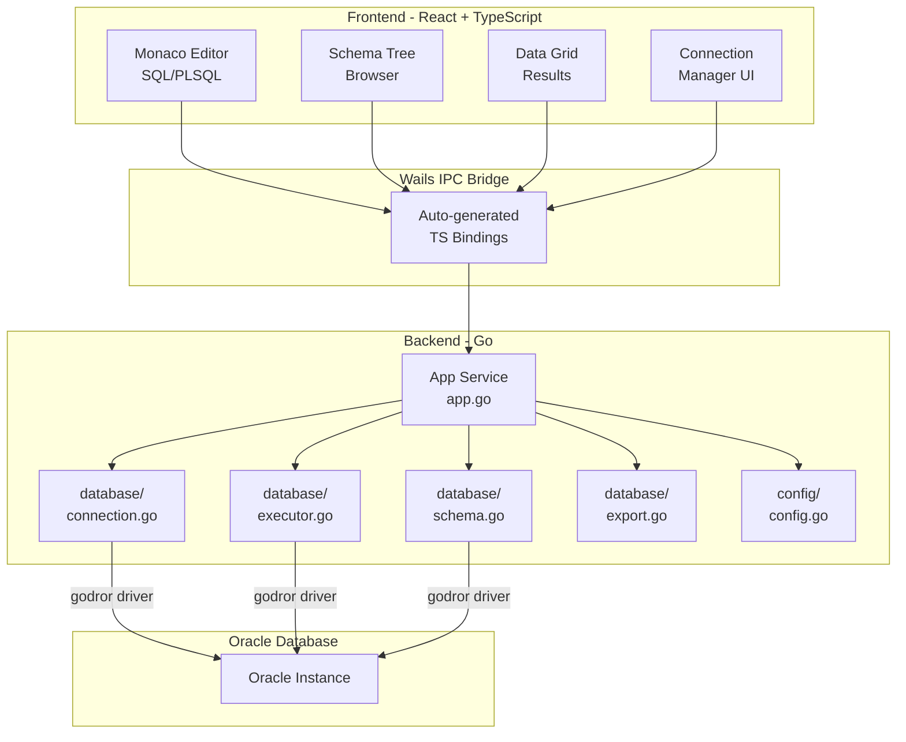

# Oracle SQL Lite - Lightweight Oracle SQL Client

> Build a lightweight Oracle SQL client desktop application using Wails v2 (Go backend + React/TypeScript frontend) with core features: SQL/PL-SQL editor (Monaco), query execution, schema browser tree, SQL autocomplete, and basic export/import.

---

## 1. Technology Stack

### Backend (Go)

- **Wails v2** (`github.com/wailsapp/wails/v2`) - Desktop app framework, auto-binds Go methods to JS
- **godror** (`github.com/godror/godror`) - Oracle database driver for Go (requires Oracle Instant Client at runtime)
- **Standard library** `database/sql` - Connection pooling, query execution

### Frontend (React + TypeScript)

- **React 18** + **TypeScript** - UI framework
- **Monaco Editor** (`@monaco-editor/react`) - Code editor (same engine as VS Code)
- **monaco-sql-languages** - SQL syntax highlighting + base autocomplete
- **Ant Design** or **Shadcn/UI** - UI component library (Tree, Table, Tabs, Modal...)
- **AG Grid Community** hoac **TanStack Table** - High-performance data grid for query results
- **Zustand** - Lightweight state management

### Build

- **Wails CLI** - `wails build` produces single binary (~10-15MB)
- Oracle Instant Client Basic Lite (~15MB) bundled or required as prerequisite

---

## 2. Project Structure

```
oracle_client_soft/
├── build/                          # Wails build assets
│   ├── appicon.png
│   └── windows/
│       ├── icon.ico
│       ├── info.json
│       └── wails.exe.manifest
├── frontend/                       # React TypeScript app
│   ├── src/
│   │   ├── App.tsx                 # Main layout
│   │   ├── main.tsx                # Entry point
│   │   ├── components/
│   │   │   ├── Layout/
│   │   │   │   ├── AppLayout.tsx       # Sidebar + Editor + Results
│   │   │   │   ├── Sidebar.tsx         # Connection list + Schema tree
│   │   │   │   └── StatusBar.tsx       # Connection status, row count, time
│   │   │   ├── Editor/
│   │   │   │   ├── SQLEditor.tsx       # Monaco Editor wrapper
│   │   │   │   ├── EditorTabs.tsx      # Multi-tab SQL worksheets
│   │   │   │   └── EditorToolbar.tsx   # Run, Stop, Format, Export buttons
│   │   │   ├── Results/
│   │   │   │   ├── ResultPanel.tsx     # Tabs: Results/Messages/DBMS Output
│   │   │   │   ├── DataGrid.tsx        # Query result table
│   │   │   │   └── MessagesPanel.tsx   # Error messages, execution log
│   │   │   ├── Schema/
│   │   │   │   ├── SchemaTree.tsx      # Tree browser component
│   │   │   │   ├── SchemaTreeNode.tsx  # Individual tree nodes
│   │   │   │   └── ObjectDetail.tsx    # Table DDL, column info on click
│   │   │   ├── Connection/
│   │   │   │   ├── ConnectionDialog.tsx    # New/Edit connection form
│   │   │   │   └── ConnectionList.tsx      # Saved connections
│   │   │   └── Export/
│   │   │       ├── ExportDialog.tsx    # Export options (CSV, JSON, SQL)
│   │   │       └── ImportDialog.tsx    # Import CSV/SQL
│   │   ├── hooks/
│   │   │   ├── useDatabase.ts          # Wails binding hooks
│   │   │   └── useAutocomplete.ts      # Schema-aware autocomplete
│   │   ├── stores/
│   │   │   ├── connectionStore.ts      # Connection state
│   │   │   ├── editorStore.ts          # Editor tabs, content
│   │   │   └── schemaStore.ts          # Cached schema metadata
│   │   ├── types/
│   │   │   └── index.ts               # TypeScript interfaces
│   │   └── utils/
│   │       ├── sqlFormatter.ts         # SQL formatting
│   │       └── export.ts               # Export helpers
│   ├── index.html
│   ├── package.json
│   ├── tsconfig.json
│   └── vite.config.ts
├── internal/                       # Go backend packages
│   ├── database/
│   │   ├── connection.go           # Connection manager (pool, connect/disconnect)
│   │   ├── executor.go             # SQL/PL-SQL execution engine
│   │   ├── schema.go               # Schema metadata queries
│   │   └── export.go               # Export/Import logic
│   ├── models/
│   │   ├── connection.go           # ConnectionConfig struct
│   │   ├── query.go                # QueryResult, Column structs
│   │   └── schema.go               # SchemaObject, Table, Column structs
│   └── config/
│       └── config.go               # App config, saved connections (JSON file)
├── app.go                          # Wails app struct - binds all services
├── main.go                         # Entry point, Wails bootstrap
├── wails.json                      # Wails project config
├── go.mod
├── go.sum
└── docs/
    └── plan.md                     # This plan document
```

---

## 3. Architecture Overview



---

## 4. Backend Implementation Details (Go)

### 4.1 Connection Manager (`internal/database/connection.go`)

```go
type ConnectionManager struct {
    connections map[string]*sql.DB  // connectionID -> pool
    configs     map[string]ConnectionConfig
}

type ConnectionConfig struct {
    ID          string `json:"id"`
    Name        string `json:"name"`
    Host        string `json:"host"`
    Port        int    `json:"port"`
    ServiceName string `json:"serviceName"`
    SID         string `json:"sid"`
    Username    string `json:"username"`
    Password    string `json:"password"`  // encrypted at rest
    Role        string `json:"role"`      // SYSDBA, SYSOPER, or empty
}
```

- Use `godror.NewConnector(params)` + `sql.OpenDB()` for connection pooling
- Support Easy Connect string format: `host:port/service_name`
- Support TNS alias (if tnsnames.ora available)
- Store connections in `%APPDATA%/OracleSQLLite/connections.json` (encrypted passwords)
- Connection test before save

### 4.2 SQL Executor (`internal/database/executor.go`)

```go
type QueryResult struct {
    Columns   []ColumnInfo        `json:"columns"`
    Rows      [][]interface{}     `json:"rows"`
    RowCount  int64               `json:"rowCount"`
    ExecTime  int64               `json:"execTimeMs"`
    HasMore   bool                `json:"hasMore"`
    Messages  []string            `json:"messages"`
}

type ColumnInfo struct {
    Name     string `json:"name"`
    Type     string `json:"type"`
    Length   int64  `json:"length"`
    Nullable bool   `json:"nullable"`
}
```

Core methods exposed to frontend:

- **`ExecuteQuery(connID, sql, maxRows)`** - SELECT queries, returns paginated results
- **`ExecuteDML(connID, sql)`** - INSERT/UPDATE/DELETE, returns affected rows
- **`ExecutePLSQL(connID, block)`** - Anonymous PL/SQL blocks, captures DBMS_OUTPUT
- **`CancelQuery(connID)`** - Cancel running query via `context.WithCancel`
- **`Commit(connID)` / `Rollback(connID)`** - Transaction control
- **`ExplainPlan(connID, sql)`** - Run EXPLAIN PLAN and return execution plan

Key implementation notes:

- Use `context.WithTimeout` for query timeout (configurable, default 60s)
- Paginate large results: fetch first N rows (default 500), load more on scroll
- Parse SQL to detect statement type (SELECT vs DML vs PL/SQL) automatically
- Capture DBMS_OUTPUT via: `DBMS_OUTPUT.ENABLE` then `DBMS_OUTPUT.GET_LINES` after execution

### 4.3 Schema Browser (`internal/database/schema.go`)

Oracle Data Dictionary queries for the tree:

```go
// Top-level schemas
func (s *SchemaService) GetSchemas(connID string) ([]string, error)
// SELECT username FROM all_users ORDER BY username

// Objects by type
func (s *SchemaService) GetTables(connID, schema string) ([]TableInfo, error)
// SELECT table_name, num_rows, last_analyzed FROM all_tables WHERE owner = :1

func (s *SchemaService) GetViews(connID, schema string) ([]string, error)
// SELECT view_name FROM all_views WHERE owner = :1

func (s *SchemaService) GetColumns(connID, schema, table string) ([]ColumnDetail, error)
// SELECT column_name, data_type, data_length, data_precision, data_scale, nullable
// FROM all_tab_columns WHERE owner = :1 AND table_name = :2 ORDER BY column_id

func (s *SchemaService) GetIndexes(connID, schema, table string) ([]IndexInfo, error)
// SELECT index_name, uniqueness FROM all_indexes WHERE owner = :1 AND table_name = :2

func (s *SchemaService) GetConstraints(connID, schema, table string) ([]ConstraintInfo, error)

func (s *SchemaService) GetProcedures(connID, schema string) ([]string, error)
// SELECT object_name FROM all_procedures WHERE owner = :1

func (s *SchemaService) GetSequences(connID, schema string) ([]string, error)

func (s *SchemaService) GetTriggers(connID, schema string) ([]string, error)

func (s *SchemaService) GetDDL(connID, schema, objectType, objectName string) (string, error)
// SELECT DBMS_METADATA.GET_DDL(:1, :2, :3) FROM dual
```

Schema tree hierarchy:

```
Connection Name
└── Schema (OWNER)
    ├── Tables
    │   └── TABLE_NAME
    │       ├── Columns
    │       ├── Indexes
    │       ├── Constraints
    │       └── Triggers
    ├── Views
    ├── Materialized Views
    ├── Procedures
    ├── Functions
    ├── Packages
    ├── Sequences
    ├── Synonyms
    └── Types
```

### 4.4 Export/Import (`internal/database/export.go`)

**Export formats:**

- **CSV** - Standard comma-separated, with headers
- **JSON** - Array of objects
- **SQL INSERT** - Generate INSERT statements
- **Excel (XLSX)** - Using `excelize` library

**Import:**

- **CSV** - Parse and generate INSERT statements, batch execute
- **SQL file** - Split by `;` delimiter and execute sequentially

Methods:

```go
func (e *ExportService) ExportQueryToCSV(connID, sql, filePath string) error
func (e *ExportService) ExportQueryToJSON(connID, sql, filePath string) error
func (e *ExportService) ExportQueryToSQL(connID, sql, tableName, filePath string) error
func (e *ExportService) ExportQueryToExcel(connID, sql, filePath string) error
func (e *ExportService) ImportCSV(connID, filePath, tableName, schema string) (int64, error)
func (e *ExportService) ExecuteSQLFile(connID, filePath string) ([]string, error)
```

Use Wails runtime dialog for file picker (save/open).

---

## 5. Frontend Implementation Details

### 5.1 Monaco SQL Editor

- Use `@monaco-editor/react` with custom Oracle SQL language configuration
- Register Oracle SQL keywords (DECODE, NVL, NVL2, CONNECT BY, START WITH, ROWNUM, etc.)
- Register custom `CompletionItemProvider` that:
  1. On typing after `.` (dot): fetch columns for the table/alias
  2. On typing after `FROM`/`JOIN`: suggest table names
  3. Default: suggest SQL keywords + cached schema objects
- Support multiple tabs (worksheets), each with its own editor instance
- Keyboard shortcuts:
  - `Ctrl+Enter` / `F5` - Execute current statement or selection
  - `Ctrl+Shift+Enter` - Execute all statements
  - `F6` - Execute as script (show messages only)
  - `Ctrl+S` - Save worksheet to file
  - `Ctrl+D` - Describe selected table name

### 5.2 Schema Tree Browser

- Use Ant Design `<Tree>` component with lazy loading (`loadData` prop)
- First level: connections -> schemas -> object types (loaded on expand)
- Each level fetches from Go backend only when node is expanded (lazy)
- Right-click context menu:
  - Table: Select Top 100, View DDL, Drop, Truncate, Export
  - View: Select, View DDL
  - Procedure/Function: View Source, Execute
- Double-click table name: inserts table name into current editor
- Drag & drop table to editor: inserts column list

### 5.3 Result Panel

- Tabbed panel below editor: **Results** | **Messages** | **DBMS Output**
- Results tab: AG Grid / TanStack Table with:
  - Virtual scrolling for large result sets
  - Sort/filter on client side
  - Copy cell/row/column
  - NULL displayed as `(null)` with distinct styling
  - Inline editing (optional, Phase 2)
- Messages tab: execution time, row count, error messages
- DBMS Output tab: captured `DBMS_OUTPUT.PUT_LINE` output

### 5.4 Application Layout

```
┌─────────────────────────────────────────────────────┐
│  Toolbar: [Connect] [Disconnect] [Commit] [Rollback]│
├────────────┬────────────────────────────────────────┤
│            │  [Tab1] [Tab2] [+]                      │
│  Schema    │ ┌────────────────────────────────────┐  │
│  Tree      │ │                                    │  │
│  Browser   │ │  Monaco SQL Editor                 │  │
│            │ │                                    │  │
│  - Tables  │ │                                    │  │
│  - Views   │ └────────────────────────────────────┘  │
│  - Procs   │ ┌────────────────────────────────────┐  │
│  - ...     │ │  Results | Messages | DBMS Output   │  │
│            │ │ ┌──────────────────────────────────┐│  │
│            │ │ │  Data Grid (results)             ││  │
│            │ │ └──────────────────────────────────┘│  │
│            │ └────────────────────────────────────┘  │
├────────────┴────────────────────────────────────────┤
│  Status: Connected to ORCL | 150 rows | 23ms        │
└─────────────────────────────────────────────────────┘
```

Resizable panels using `react-resizable-panels` or `allotment` library.

---

## 6. SQL Autocomplete Engine

### Strategy: Two-layer autocomplete

**Layer 1 - Static (bundled):**

- Oracle SQL keywords (SELECT, FROM, WHERE, GROUP BY, etc.)
- Oracle built-in functions (NVL, DECODE, TO_DATE, TO_CHAR, SUBSTR, etc.)
- PL/SQL keywords (DECLARE, BEGIN, END, EXCEPTION, LOOP, etc.)
- Data types (VARCHAR2, NUMBER, DATE, CLOB, BLOB, etc.)

**Layer 2 - Dynamic (from database, cached):**

- Schema names (from `ALL_USERS`)
- Table/View names (from `ALL_TABLES`, `ALL_VIEWS`)
- Column names (from `ALL_TAB_COLUMNS`) - fetched per table, cached
- Procedure/Function names (from `ALL_PROCEDURES`)
- Synonym names (from `ALL_SYNONYMS`)

**Cache strategy:**

- On first connect: fetch table/view names for current schema (background)
- On dot-completion: fetch columns for specific table (cache indefinitely until refresh)
- Manual refresh button in schema tree to invalidate cache
- Store in Zustand store, survives tab switches

**Context-aware completion:**

- After `SELECT`: suggest columns (if table context known), functions, `*`
- After `FROM` / `JOIN`: suggest tables, views, synonyms
- After `WHERE` / `AND` / `OR`: suggest columns
- After `.`: suggest columns for the table/alias before the dot
- Inside PL/SQL block: suggest PL/SQL keywords + variables

---

## 7. Implementation Phases

### Phase 1 - Foundation (Week 1-2)

- Wails project scaffolding (`wails init -n oracle_client_soft -t react-ts`)
- Go backend: ConnectionManager, basic query execution
- Frontend: Application layout, connection dialog, basic Monaco editor
- Connect to Oracle, execute simple SELECT, display results in basic table

### Phase 2 - Core Features (Week 3-4)

- Schema tree browser with lazy loading (all object types)
- Multi-tab editor with tab management
- Enhanced result grid (virtual scroll, copy, sort)
- Messages panel and DBMS Output capture
- Commit/Rollback support

### Phase 3 - Autocomplete & Intelligence (Week 5)

- Static keyword autocomplete
- Dynamic schema-aware autocomplete with caching
- Context-aware dot-completion
- SQL formatting (using a JS library like `sql-formatter`)

### Phase 4 - Export/Import & Polish (Week 6)

- Export to CSV, JSON, SQL, Excel
- Import CSV and SQL files
- Table DDL viewer (via `DBMS_METADATA.GET_DDL`)
- Explain Plan viewer
- Keyboard shortcuts complete
- Error handling and edge cases

### Phase 5 - Packaging & Release (Week 7)

- App icon and branding
- Windows installer (NSIS via Wails build)
- Documentation / README
- Oracle Instant Client bundling or detection
- Performance testing with large result sets

---

## 8. Key Dependencies

### Go (`go.mod`)

```
github.com/wailsapp/wails/v2
github.com/godror/godror
github.com/xuri/excelize/v2      // Excel export
```

### Frontend (`package.json`)

```
@monaco-editor/react             // Monaco Editor for React
monaco-sql-languages             // SQL language support (or custom)
antd                             // UI components (Tree, Table, Modal, etc.)
@ant-design/icons                // Icon set
zustand                          // State management
allotment                        // Resizable split panels
ag-grid-react / ag-grid-community // Data grid (or @tanstack/react-table)
sql-formatter                    // SQL formatting
```

---

## 9. Prerequisites / Environment Setup

1. **Go 1.21+** installed
2. **Node.js 18+** installed
3. **Wails CLI**: `go install github.com/wailsapp/wails/v2/cmd/wails@latest`
4. **Oracle Instant Client** (Basic or Basic Lite) installed and in PATH
5. **GCC/MinGW** on Windows for CGO (required by godror)
6. Run `wails doctor` to verify environment

---

## 10. Performance Considerations

- **Memory**: Target < 100MB idle, < 300MB with large result sets
- **Query results**: Stream/paginate (fetch 500 rows at a time, load more on scroll)
- **Schema cache**: Lazy load, only fetch when user expands tree node
- **Connection pool**: Use `sql.DB` built-in pool, max 5 connections per database
- **Large exports**: Stream to file, don't buffer entire result in memory
- **Frontend bundle**: Use Vite tree-shaking, Monaco loads SQL language only
